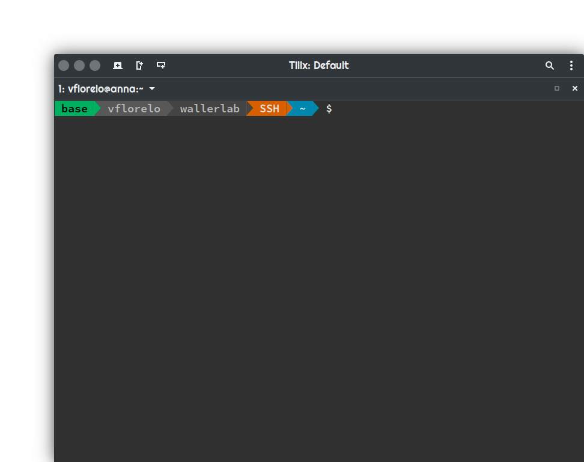
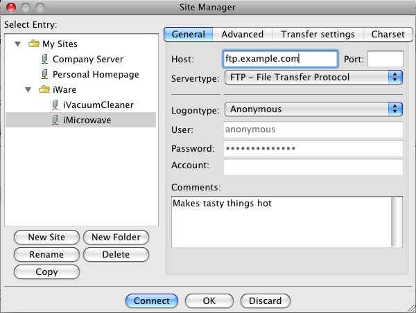

System recovery and changelog
=============================

Recently the linux machine in the lab underwent critical updates and data rescue. Some changes took place since the update:

* Most of the previously installed programs were converted into modules in order to promote reproducibility and code stability
* Usernames and passwords were assigned to individuals in the laboratory in order to reduce potential data loss due to overwriting in shared locations
* Shared locations were mounted in separate partitions
  - `/wallerlab` contains software and modules
  - `/perkinsus` contains *Perkinsus* shared data
  - `/hematodinium` contains *hematodinium* shared data
  - These locations have read/write permissions on a group basis
  - In the event of a system failure, the shared locations should not be affected since they are mounted on separate partitions
* The usage of Python2 Programs is discouraged since Python2 is deprecated in most systems
* Swap memory was turned off since this was the most likely cause for the previous system failure

Quick primer on linux and command line
======================================

Most of the available programs do not have a graphical user interface, thus, a primer on linux and command line is necessary

Please follow this [link](https://ubuntu.com/tutorials/command-line-for-beginners) for details.

Long story short:
	* Always remember to look at your prompt
	* Mind your lower-case and upper-case commands
	* Always check your current directory and current files
	* Always tell your command to yourself, if it makes sense to you, it might make sense to the machine as well

Access to the machine
=====================

If the user is in the premises the access is straightforward, only a username and password is required.

If the user is working remotely the machine can be accessed via `ssh`

`ssh` for windows users
-----------------------

1. Download and decompress the [MobaXterm](https://download.mobatek.net/2062020111930940/MobaXterm_Installer_v20.6.zip) installer
2. Install the program
3. Log in the machine using

	`ssh -X username@131.111.47.2`

	If you do not have a username please let me know

`ssh` for OSX users
-------------------

1. Go to Applications -> Utilities -> Terminal
2. Log in the machine using

	`ssh -X username@131.111.47.2`

	If you do not have a username please let me know

`ssh` for Unix/Linux users
--------------------------

1. Open your terminal application (gnome-terminal, konsole, tilix, xterm)
2. Log in the machine using

	`ssh -X username@131.111.47.2`

	If you do not have a username please let me know

In all cases, once you typed the `ssh` command, the server will ask you for your password. Type in your password, just keep in mind that despite the characters are not visible, they are there. Press enter and you should see your prompt

Your prompt will tell you

1. Who you are
2. That you are using the lab machine
3. Your current directory
4. What conda environments you have active (that green box on the left)

Available programs
==================

|-------------------|---------------------|-------------------------|-------------------|-------------------|-----------------|--------------------|
|-------------------|---------------------|-------------------------|-------------------|-------------------|-----------------|--------------------|
|ab-blast/2020.03.17|CodingQuarry/2.0     |GeneMark-ES/4.62         |isoblat/0.31       |MultiQC/1.9        |RepeatScout/1.0.5|Synima/2021.01.18   |
|Augustus/3.4.0     |Count/10.04          |GeneMark-HMM_euk/2.2_3.54|Jellyfish/2.3.0    |mummer4/4.0.0      |rmblast/2.10.0   |tantan/23           |
|bamtools/2.5.1     |CRL_scripts/1.0      |GeneMark-S/1.14_1.25     |kallisto/0.46.2    |muscle/3.8.31      |RSEM/1.3.3       |targetp/2.0         |
|bbmap/38.87        |deeploc/1.0          |GeneMark-S2/4.3          |kofam_scan/1.3.0   |netNES/1.1         |salmon/1.4.0     |tatp/1.0            |
|bcftools/1.11      |deepnog/1.2.2        |GeneMark-ST/5.1          |lastz/1.04.10      |NINJA/0.95         |samtools/1.11.18 |tbl2asn/25.8        |
|bedtools/2.29      |diamond/2.0.6        |genetack/1.20            |LipoP/1.0a         |OrthoFinder/2.5.2  |SANSPANZ/3       |tmhmm/2.0c          |
|blast+/2.11.0      |easel/0.1            |genometools/1.6.1        |LTR_retriever/2.9.0|ParseRNAseq/1.0    |seg/2021.01.18   |TransDecoder/5.5.0  |
|blast/2.2.26       |edirect/14.4         |gffread/0.12.5           |mafft/7.475        |PASA/2.4.1         |sepp/4.3.10      |TRF/4.10.0          |
|blat/36x9          |eggnog-mapper/1.0.3  |GlimmerHMM/3.0.4         |maker/3.01.03      |phyloFlash/3.4     |seqkit/0.15.0    |trimal/1.4          |
|bowtie/1.3.0       |EMBOSS/6.6.0         |gmap/2020.12.17          |MCScanX/2021.01.18 |Prodigal/2.6.3     |seqtk/1.3        |Trimmomatic/0.39    |
|bowtie/2.4.2       |EVidenceModeler/1.1.1|hhsuite/3.3.0            |mdust/2021.01.18   |proteinortho/6.0.27|signalP/5.0b     |Trinity/2.11.0      |
|busco/4.1.4        |exonerate/2.4.0      |hisat2/2.2.1             |metaeuk/4-a        |psipred/4.02       |SNAP/2021.01.20  |tRNAscan-SE/2.0     |
|bwa/0.7.17         |fasta/36.3.8h        |hmmer/3.3.2              |MetaGeneMark/3.38  |raxml-ng/1.0.1     |sortmerna/4.2.0  |UCSCtools/2021.01.18|
|cdhit/4.8.1        |FastQC/0.11.9        |htslib/1.11.18           |metagenetack/1.0   |raxml/8.2.12       |SPAdes/3.15.0    |vcftools/0.1.17     |
|chlorop/1.1        |FastTree/2.1.11      |infernal/1.1.4           |minimap2/2.17      |RECON/1.08         |SRAtoolkit/2.10.9|vsearch/2.15.1      |
|circos/0.69.9      |funannotate/1.8.3    |iqtree/1.6.12            |MITE_Hunter/2011.11|RepeatMasker/4.1.1 |STAR/2.7.7a      |                    |
|clustal-o/1.2.4    |geneid/1.4.5         |iqtree/2.1.2             |MMseqs/2.12.113e3  |RepeatModeler/2.0.1|stringtie/2.1.4  |                    |

Software usage
==============

Whenever the user logs in the machine, no modules are loaded, meaning that no bioinformatics software is available for use.

If the user wants to run a specific program or programs, the corresponding module should be loaded:

1. User logs in

	`ssh -X vflorelo@131.111.47.2`

2. The `$PATH` environment variable contains a limited set of folders

	`echo $PATH`
	`/opt/anaconda/bin:/opt/anaconda/condabin:/usr/local/sbin:/usr/local/bin:/usr/sbin:/usr/bin:/sbin:/bin:/usr/games:/usr/local/games:/snap/bin`

3. Suppose the user wants to run Trinity

	`module load Trinity/2.11.0`

4. Now the `$PATH` variable contains the necessary info to run Trinity

	`echo $PATH`
	`/wallerlab/bioinformatics/software/Trinity.2.11.0:/wallerlab/bioinformatics/software/samtools.1.11-18-gc17e914-dirty/bin:/wallerlab/bioinformatics/software/Jellyfish.2.3.0/bin:/wallerlab/bioinformatics/software/salmon.1.4.0/bin:/wallerlab/bioinformatics/software/bowtie.1.3.0/bin:/wallerlab/bioinformatics/software/bowtie.2.4.2/bin:/opt/anaconda/bin:/opt/anaconda/condabin:/usr/local/sbin:/usr/local/bin:/usr/sbin:/usr/bin:/sbin:/bin:/usr/games:/usr/local/games:/snap/bin`

5. In addition some programs (like Trinity) require additional variables, the module command deals with such requirements

	`echo $TRINITY_HOME`
	`/wallerlab/bioinformatics/software/Trinity.2.11.0`

6. If a user requires a program that is not currently available, it can be installed using conda. However for such a purpose the user needs to create a private environment
   - In the following example we are going to create an environment called alignments in which we are going to install the programs samtools, fastqc and bwa from the channels bioconda

	`conda create -n alignments -c bioconda samtools fastqc bwa`

	Note on disk usage: Conda environments tend to be disk hungry, thus, even if the user is allowed to create as many environments as required, it is advised that if a software is needed it should be installed as a module

Hardware usage
==============

The machine runs an Intel Xeon processor with 32 cores @ 2.10GHz. The available RAM memory is currently set to 32Gb. There are no limits to the hardware usage per user, **however**, each user (the admin included) should not use all the available resources at once.

Here is a recommended resource usage table

|Task                            |CPU     |RAM  |Priority            |Est. Time |
|--------------------------------|--------|-----|--------------------|----------|
|Clustering (orthofinder)        |32 cores|32 Gb|Urgent              | <2h      |
|Clustering (Orthofinder)        |16 cores|16 Gb|Non urgent but quick| 2-4h     |
|Clustering (Orthofinder)        | 8 cores| 8 Gb|Non urgent no rush  | 4-8h     |
|Genome annotation (funannotate) |32 cores|32 Gb|Urgent              | 3h       |
|Genome annotation (funannotate) |16 cores|16 Gb|Non urgent but quick| 4-6h     |
|Genome annotation (funannotate) | 8 cores| 8 Gb|Non urgent no rush  | up to 12h|

The user should be considered enough as to what is an *urgent* process

The user can check the available resources by issuing the commands `htop` and `users` beforehand in order to see how many cores and how much memory is available at the moment.

File transfer
=============

If the user is in the lab, file transfers can be done with a removable device or with a web browser. However, if the user is working remotely, a special program is needed to exchange files

File transfer for windows users
-------------------------------

1. Download and install [WinSCP](https://winscp.net/download/WinSCP-5.17.10-Setup.exe)
2. When the program starts it will ask you for your login details and the transfer protocol
   1. Set protocol to "scp" or "sftp" ("scp" is faster but does not allow you to resume incomplete transfers)
   2. Set host name to "131.111.47.2"
   3. Set port number to "22"
   4. Log in with your credentials, you might want to save this information to reduce typing

3. Assuming everything is correct, the program will open a directory window similar to Windows File Explorer

File transfer for OSX users
---------------------------

1. Download and install [Filezilla](https://filezilla-project.org/download.php?platform=osx)
2. When the program starts it will ask you for your login details and the transfer protocol
   1. Set protocol to "scp" or "sftp" ("scp" is faster but does not allow you to resume incomplete transfers)
   2. Set host name to "131.111.47.2"
   3. Set port number to "22"
   4. Log in with your credentials, you might want to save this information to reduce typing

3. Assuming everything is correct, the program will show four panes listing your local files (left panes) and remote files (right panes)

File transfer for command line users
------------------------------------

Either you are using windows, linux or OSX, you can transfer files using rsync or scp

1. Transfer files from your computer to the lab machine
   1. Open a terminal
   2. `cd` to the directory containing the files you want to transfer
   3. Transfer your files to the machine

	 	`rsync -azvh --partial --progress your_file.txt username@131.111.47.2:`

   4. Type your password

2. Transfer files from the lab machine to your computer
   * In this example we are assuming there is a file named `example.txt` in the folder `/perkinsus`
   1.  Open a terminal
   2. Transfer your files from the remote machine

	 	`rsync -azvh --partial --progress username@131.111.47.2:/perkinsus/example.txt .`

		**Don't forget the period at the end to tell `rsync` you need your files in your current local directory **

   3. Type your password

Future development
==================

* Increase the available memory
* Install a web interface for ease of access
* Install a web interface for file exchange
