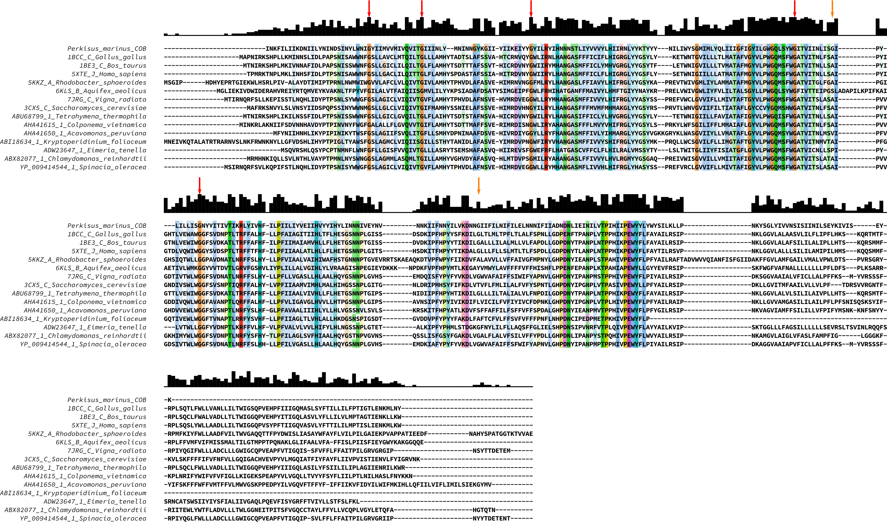
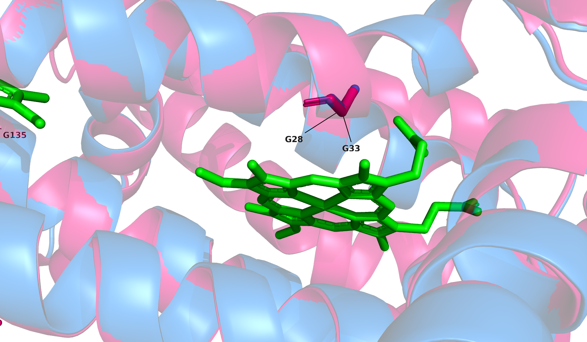
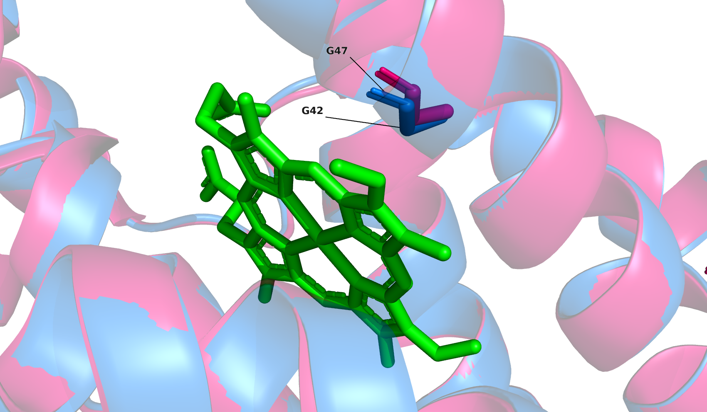
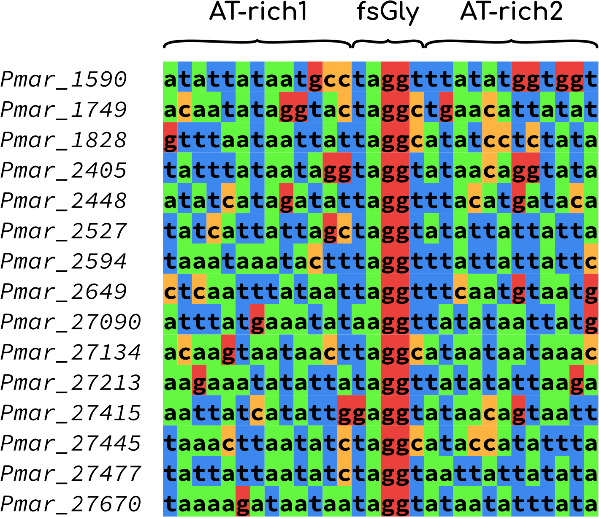
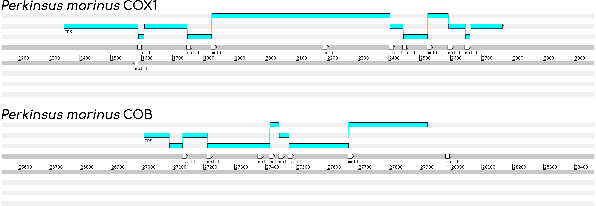

# Frameshifts in the mitochondrial genomes of *Perkinsus marinus*, *Perkinsus atlanticus* and *Perkinsus olseni*

As previously described [before](https://pubmed.ncbi.nlm.nih.gov/20507907/), genes in the mitochondrial genome of Perkinsus marinus undergo translational frameshifts at specific positions. The most abundant sequence triggering these frameshifts was `TAGGT`.

In order to assess the importance and accuracy of the frameshifts we first tested if the glycines involved were conserved in similar proteins from different organisms. For such a purpose we threaded the amino acid sequences of *P. marinus* COX1, COX3 and COB onto known structures using [I-TASSER](https://zhanglab.ccmb.med.umich.edu/I-TASSER/) and [raptorX](http://raptorx.uchicago.edu/). The resulting structures were superimposed to known structures using [pymol](https://pymol.org/2/) v2.04

|Protein|I-TASSER file|RaptorX file|RCSB target|
|-------|-------------|------------|-----------|
|COX1|[Model 1](COX1_i.pdb)|[Model 1](COX1_r.pdb)|[1V54:A](https://www.rcsb.org/structure/1V54)|
|COX3|[Model 1](COX3_i.pdb)||[1V54:C](https://www.rcsb.org/structure/1V54)|
|COB|[Model 1](COB_i.pdb)|[Model 1](COB_r.pdb)|[3CHX:C](https://www.rcsb.org/structure/3CXH)|

The conservation of the frameshifted residues has already been observed in the work of Masuda *et al*., 2010; in addition no frameshifts have been predicted in COX3. Thus, we performed the structural alignments using the predicted structure of COB and chain C from the yeast cytochrome C structure (PDB:3CXH).
In pymol2, having loaded both structures:
```
super super Pmar_COB_ITASSER, Yeast_COB_3CXH_C
```
The superimposed structures yielded an estimated [RMSD](https://en.wikipedia.org/wiki/Root-mean-square_deviation_of_atomic_positions) of 0.443 indicating that both structures were quite similar.
We then selected the glycine residues in the structure of Pmar_COB to see if they matched those of 3CXH:

The predicted structure of Pmar_COB (blue) matched the structure of yeast cytochrome B (pink). Most of the glycine residues of Pmar_COB had homologous residues in 3CXH, suggesting a functional relevance of the frameshifts in the mitochondrial genome. Only Glycine 145 and 219 displayed no homologous residues in 3CXH.

To see if the selected residues were conserved in other organisms, we searched in public databases using DELTA-BLASTP for similar structures. Our search was limited to sequences with known structures in PDB for mammals, fungi and plants, we also searched in the non-redundant database for sequences of green plants, and organisms in the phylum *Alveolata*.

The sequences were aligned using clustal omega v.1.2.1 within the [seaview](http://doua.prabi.fr/software/seaview) package. The alignment was formatted using [Jalview 2](https://www.jalview.org/).


Most of the glycine residues corresponding to frameshifted codons were conserved in all the compared sequences (red arrows), however Glycine 145 and 219 showed less conservation than the other residues (orange arrows).

Based on the annotations of the 3CXH we also searched for the possible functions of the glycine residues in the Pmar_COB protein.

Glycine 28 might be involved in heme binding as suggested by the structural alignment


Glycine 42 might be involved in heme binding as suggested by the structural alignment


Based on the annotations from [Uniprot:P00163](https://www.uniprot.org/uniprot/P00163) we also might draw conclusions on the topology of the glycine residues:

|Pmar residue|Yeast residue|Topology            |
|------------|-------------|--------------------|
|G28         |G33          |Transmembrane       |
|G42         |G47          |Transmembrane       |
|G68         |G75          |Transmembrane       |
|G135        |G143         |Intermembrane domain|
|G145        |A153         |Intermembrane domain|
|G155        |G167         |Intermembrane domain|
|G219        |T232         |Transmembrane       |

Now that we had more information on the glycine residues, back to the genome.

By taking a closer look at the frameshifted sequences we start to se a pattern: each frameshifted glycin codon was preceded by a leucine or valine codon

```
LGLYG
LGLWT
LGISS
VGITG
LGLHD
LGILL
LGLLL
LGFNV
```

We then extracted the corresponding positions of the frameshifts +/- 15 nucleotides and detected two AT-rich regions:

```bash
for pos in $(grep join Pmar_mt.fasta | perl -pe 's/.*\(//;s/\)//g;s/\,/\n/g' | cut -d\. -f1)
do
  start_pos=$(echo $pos | awk '{print $1-15}')
	end_pos=$(echo   $pos | awk '{print $1+15}')
	seqret Pmar_mt.fasta -sbegin $start_pos -send $end_pos fasta::stdout | perl -pe "s/\>.*/\>Pmar_$pos/"
done > Pmar_mt.fs.fasta
```



Since there appears to be some degree of conservation we constructed a position specific matrix using [meme](https://meme-suite.org/) to find a single motif with a single occurrence per sequence

```bash
meme Pmar_mt.fs.fasta -oc Pmar_frameshifts.meme -dna -mod oops -nmotifs 1
```

The resulting matrix was:

|A       |C       |G       |T       |
|--------|--------|--------|--------|
|0.133333|0.333333|0.133333|0.400000|
|0.066667|0.000000|0.066667|0.866667|
|1.000000|0.000000|0.000000|0.000000|
|0.000000|0.000000|1.000000|0.000000|
|0.000000|0.000000|1.000000|0.000000|
|0.000000|0.266667|0.000000|0.733333|
|0.533333|0.000000|0.000000|0.466667|
|0.200000|0.000000|0.066667|0.733333|
|0.733333|0.066667|0.000000|0.200000|
|0.533333|0.133333|0.000000|0.333333|
|0.266667|0.333333|0.000000|0.400000|
|0.666667|0.066667|0.000000|0.266667|
|0.133333|0.000000|0.333333|0.533333|

We then used this matrix to search for additional occurrences in the mitochondrial genome of Perkinsus marinus

```bash
fimo -oc Pmar_frameshifts.fimo Pmar_frameshifts.meme/meme.txt Pmar_mt.fna
```

Several occurrences were predicted, our positive controls were of course the frameshifts previously detected in COX1 and COB



For the COX1 gene all the Gly frameshifts were predicted accurately, the two frameshifts not depicted correspond to alternate codons for proline

In the COB gene only the first frameshift could not be detected however it is clearly different from the cannonical sequence TAGGT.

Based on these preliminary results we might be able to
1. Detect other possible frameshifts in the mitochondrial genome of *Perkinsus marinus*
2. Detect possible frameshifts in the mitochondrial genomes of the other *Perkinsids*
3. Detect possible frameshifts in the nuclear genomes of the *Perkinsids* of the other projects

For further information, the fimo predictions on the *Perkinsus marinus* mitochondrial genome are available [here](mitochondrial_genomes/PM_mtDNA_FINAL.fimo.gff)
